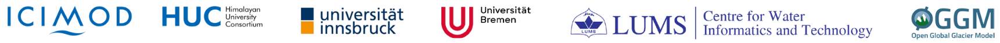

# Welcome

This is the companion website to the [HUC Training on glacier modelling: Practical applications with the Open Global Glacier Model](https://huc-hkh.org/events/training-on-glacier-modelling-practical-applications-with-the-open-global-glacier-model) organized at LUMS in Lahore, Pakistan, from 10 March 2023 to 16 March 2023.

```{note}

The training is now over! We will leave this website up for documentation purposes.


**For future updates, visit [the OGGM documentation](https://docs.oggm.org) and [tutorials](https://oggm.org/tutorials).**

```

## License

[](https://creativecommons.org/licenses/by/4.0)

This document is licensed under a [Creative Commons Attribution 4.0 International License](https://creativecommons.org/licenses/by/4.0/) unless specified otherwise.
